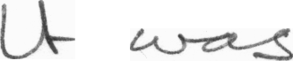

# Digitization of Handwritten Text

&nbsp;

    
   **Handwriting Recognition** (HWR) is also known as **Handwritten Text Recognition** (HTR) is the ability to transcribe the handwritten text into digital text. The attributes are Online Text Recognition and Offline Text Recognition. In Online text Recognition, the information’s are gathered though real-time data provided by the real-time writing sensors [i.e., Digitizing tablet]. On the other hand, Offline Text Recognition gathers existing information like images and process them based on two techniques. Firstly, Typed Text is used to convert the unreadable existing images into a readable format. Secondly, Handwritten Text uses manual handwritten notes as an input image and process them into a human-readable format. Earlier, before the development of Deep Learning, the HTR uses **Hidden Markov Model** (HMM) for processing the image into a readable format. Although HMM is very efficient, it cannot be applied on pointwise nonlinearity to the output at every timestep, this being the main reason to opt **Convolutional Recurrent Neural Network** (CRNN) and **Connectionist Temporal Classification** (CTC) techniques. 

&nbsp;

# Pre-Requests:

Below are the requests,

1.	Update the location for the data and output folder in the code.
2.	Use TensorFlow 1.14.0 version.

&nbsp;

# To Run the Code:

On opening the terminal, it is essential to navigate towards the particular folder where the python file is located.

> Python TextRecognization.py

&nbsp;

# Dataset:

The [Iam Dataset](https://www.kaggle.com/tejasreddy/iam-handwriting-top50) consists of _4,899_ images of notes which are written by different people, which will be passed into the model which will scan the images and convert them into a digital text Notepad file. Data is grouped by written a collection of sentences. We copy the image and resize the image with the width of 128 and height of 42. The images from the dataset will not have the same pixel size . The image should be in **.png** format. By copying the image to random positions instead of moving to the left the data pre-processing can be integrated.

&nbsp;

**Note:**

For the sample analysis out of the 4899 images only 6 of the images are being considered, where the handwritten text image is converted into the digital text and saved in a notepad file.

&nbsp;

**We taken the input image _r06-126-s01-00.png_ from the data**

&nbsp;

# Word Segmentation:

Now the pre-processed image is sent for the word segmentation, in this,  we will split the sentence present in the image into words and save it as .png image. We are splitting the sentence as the human process in deriving the computer-based techniques for word segmentation which is similar to the human visual system is quite complex.

&nbsp;

**Each words of the sentence in the above input image get splits up into seprate images**

&nbsp;

# Model:

We pass each image into the three different layers, 

1. In the **Convolutional Neural Network** (CNN) layer, we are extracting the relevant features present in the image and is classified into three operations. 
   - Firstly, the convolution operation is applied to the kernel filter of size 5x5 in two layers and 3x3 for the last two layers. 
   - Secondly, Non-Linear ReLU function is applied. 
   - Finally, we use max-pooling to summarize the image regions and output a downsized input version. The output feature map has a size of 32x256. 

2. In the **Recurrent Neural Network** (RNN) layer, the feature sequence contains 256 features per time-step, it will propagate relevant information. The **Long Short-Term Memory** (LSTM) implementation of RNNs is used as it could propagate through long-distance and is quite robust on comparing with the vanilla RNN. The output sequence from the RNN is being mapped to a matrix which is of size 32x80. 

3. Finally, in the **Connectionist Temporal Classification** (CTC) layer, the loss value and the final text is calculated from the RNN output matrix and the true text.

&nbsp;

    <b>The Recognized text from the input image is "It was" </b>

&nbsp;

# Validation:

- The label data has been created for all the 4899 images which will have image name and their actual output which is been saved within the folder data under the name **Labelled_Data**.

- Validating the model built is performed by calculating the eval distance between the actual output and the predicted one. The metrics used are **Character Error Rate** (CER) and **Word Error Rate** (WER). 

&nbsp;

    For the Predicted Output, we calculated the CER and WER  
    <b><u>Character Error Rate:</u> 23.982815911288103  
        <u>Word Error Rate:</u> 4.225148197897482 </b>

&nbsp;

Finally, we will save the predicted output, CER and WER to the notepad.

    The Output saved in the notepad file for the given input image is  
    <b> Text Recognized is :  It was  
        Character Error Rate: 23.982815911288103  
        Word Error Rate: 4.225148197897482  

